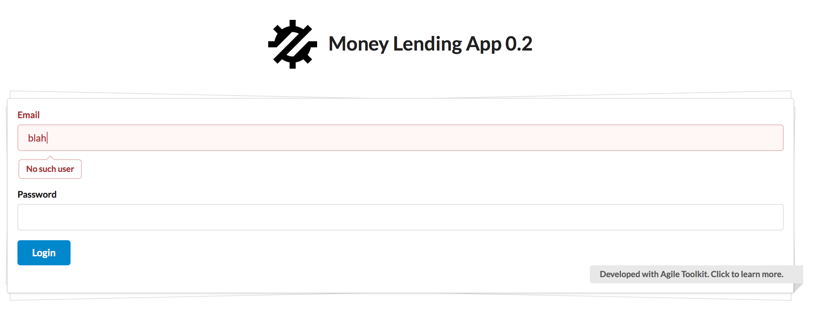

# Money Lending App

**If you are new to Agile Toolkit, read http://www.agiletoolkit.org/intro first**.

Assuming that you have already cloned this application and running on your local server, you should see in your browser:


That means that Agile Toolkit is installed and your PHP works perfectly. You'll also need need MySQL for this tutorial, so you should probably start downloading it.

## Creating File structure

Our project will be multi-file application. I'll be creating files such as `admin.php`, `index.php`, `contact.php` and but to avoid code duplication I'll also create  file  `lib.php`, where I'll be putting all of my objects. If you prefer to use PSR class loader or URL routing, you should be able to figure it out yourself.

The first class I'll add into `lib.php` will be MyApp. Extending from the standard App, I'll add some properties and methods which are specific to my money lending application. This is what your  `lib.php` should contain (see below for clarifications):

``` php
<?php
require'vendor/autoload.php';
session_start();

class MyApp extends \atk4\ui\App {
    public $title = 'Money Lending App 0.2';
    public $db;
    public $user;

    function __construct() {
        parent::__construct();

        
        $this->db = new \atk4\data\Persistence_SQL(
         'mysql:host=127.0.0.1;dbname=money_lending', 
         'root', 
         'root'
        );
       
        $this->initLayout('Admin');

        $this->layout->leftMenu->addItem(['Contacts', 'icon'=>'users'], 'contact.php');
        $this->layout->leftMenu->addItem(['Admin', 'icon'=>'lock'], 'admin.php');
    }
}
```

At the top - always include autoloader and since we will want to use log-in, we should start the session.

MyApp class contains several properties - $title is the name of my application. The $db and $user properties will be used to hold my MySQL database persistence object and the model of a currently-logged-in user.

Create file `admin.php` with just this lines:

``` php
<?php
require'lib.php';
$app = new MyApp();
```

Opening it up in your browser, yous hould see the application layout like this:


## Setting up the Database

We are buliding a multi-user application, so you'll need a table for storing user accounts. Each account has many contacts and each contact has many loans. Here is how my database schema looks like:


Here I include SQL dump, which you can import into MySQL:

```sql
CREATE TABLE IF NOT EXISTS `user` (
  `id` INT NOT NULL AUTO_INCREMENT,
  `email` VARCHAR(255) NULL,
  `password` VARCHAR(255) NULL,
  `name` VARCHAR(255) NULL,
  `surname` VARCHAR(255) NULL,
  PRIMARY KEY (`id`))
ENGINE = InnoDB;

CREATE TABLE IF NOT EXISTS `contact` (
  `id` INT NOT NULL AUTO_INCREMENT,
  `name` VARCHAR(255) NULL,
  `email` VARCHAR(255) NULL,
  `phone_number` VARCHAR(255) NULL,
  `user_id` INT NOT NULL,
  PRIMARY KEY (`id`),
  INDEX `fk_contact_user1_idx` (`user_id` ASC),
  CONSTRAINT `fk_contact_user1`
    FOREIGN KEY (`user_id`)
    REFERENCES `user` (`id`)
    ON DELETE CASCADE
    ON UPDATE NO ACTION)
ENGINE = InnoDB;

CREATE TABLE IF NOT EXISTS `loan` (
  `id` INT NOT NULL AUTO_INCREMENT,
  `contact_id` INT NOT NULL,
  `amount` DECIMAL(8,2) NOT NULL,
  `due` DATE NOT NULL,
  `repaid` DECIMAL(8,2) NOT NULL,
  `is_active` TINYINT(1) NOT NULL,
  PRIMARY KEY (`id`),
  INDEX `fk_loan_contact1_idx` (`contact_id` ASC),
  CONSTRAINT `fk_loan_contact1`
    FOREIGN KEY (`contact_id`)
    REFERENCES `contact` (`id`)
    ON DELETE CASCADE
    ON UPDATE NO ACTION)
ENGINE = InnoDB;
```

Additionally you need to define Model classes. I'll just start with the User class. Add the following code into `lib.php` file:

``` php
class User extends \atk4\data\Model {
    public $table = 'user';

    function init()
    {
        parent::init();

        $this->addFields([
            'email',
            ['password', 'type'=>'password'],
            'name',
            'surname'
        ]);
    }
}
```

We simply describing the fields and their types of a Model. Finally add the following line to your `admin.php` file:

``` php
$app->layout->add('CRUD')->setModel(new User($app->db));
```

 Refresh the `admin.php` page and it will have a fully functional CRUD element where you can add a few users:


Be sure to remember what password you have used.

## Setting up Log-in screen

To make a nicely looking log-in the 'Centered' layout would be most suitable. However, `MyApp` already initializes 'Admin', so I'm going to add an argument to the constructor of MyApp class to bypass the authentication:

``` php
    function __construct($authenticate = true) {
    //                   ^^^^^^^^^^^^^^^^^^^^
```

Then the body of constructor should have this code:

``` php
        if (!$authenticate) {
            $this->initLayout('Centered');
            return;
        }

        $this->initLayout('Admin');
```

You should be able to understand this code intuitively. Next open your `index.php` and and modify it so it would initialise `MyApp` instead of using `App`. You also no longer need `initLayout`. You should also replace `require` line to include `lib.php`. Your `index.php` now should look like this:

``` php
<?php
require'lib.php';

$app = new MyApp(false);

// further code goes here

$app->layout->add([
  'Label', 
  'Developed with Agile Toolkit. Click to learn more.',
  'right ribbon gray'
])->link('https://github.com/atk4/money-lending-tutorial');
```

Now lets create a Form with email/passord fields:

``` php
$form = $app->layout->add('Form');
$form->addField('email');
$form->addField('password');

$form->buttonSave->set('Login');
```

I added an extra line that changes the label of the default 'Save' button to 'Login'. 



Next you need to add form submit callback which will check if email/password correspond to any user:

``` php
$form->onSubmit(function($form) { 

    $m = new User($form->app->db);
    $m->tryLoadBy('email', $form->model['email']);

    if (!$m->loaded()) { 
        return $form->error('email', 'No such user');
    }

    return 'OK for now';
});
```

The `onSubmit` method will be called on form submission and because closures in PHP by default can't access any variables defined outside, it passes the $form into the callback.

Agile Toolkit automatically sets the `app` property of all the objects to point to `MyApp`, which makes it very easy for me to access the $db property. Creating new object User will not perform any loading just yet, so teh next line will attempt to find user with a specified email. Even though I didn't specify any `Model` to the form just yet, it will create an anonymous model and populate fields. In 95% of use-cases you would want to use Form with `setModel`.

Form's method `error` returns Action for displaying error on a form just below a specified field and containing specified text. I can either return a single error or array of multiple errors. 